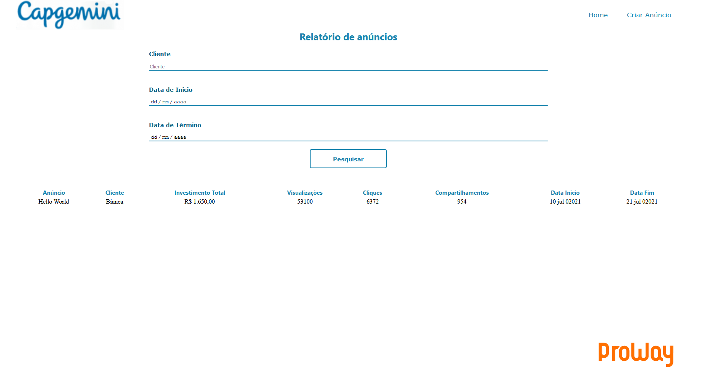

# Cadastro de anúncios
Programa criado para o desafio de programação Proway, Academia Capgemini
 
 

<h1>Para a execução:</h1>

Ter uma IDE tal como [Intellij](https://www.jetbrains.com/pt-br/idea/)
 
 

  
<h1>Download e carregamento de projeto na IDE</h1>

Realize o download do zip do programa

Na pasta de sua preferencia realize a extração do projeto

Abra o Intellij vá em File > Open, selecione a pasta do projeto. Caso apareça uma mensagem >Trust Gradle Project, selecione >Trust Project

Aguarde até que as depêndencias terminem de carregar (este processo pode levar alguns minutos)

Após o carregamento é possível realizar a execução do projeto acessando o arquivo CadastroanunciosApplication que se encontra na pasta src>main>java>
 
 

<h1>Utilizando o sistema</h1>

Após a execução na IDE, acesse o navegador de sua escolha na barra de busca informe http://localhost:8080

Na tela inicial há duas opções sendo uma delas para realiar o cadastro de novos anúncios e outra para realiar a consulta e gerar o relatório de anúncios já criados

Ao selecionar >Criar anúncio aparecerá as o cadastro onde todos os campos tem preenchimento obrigatório, e no topo apare a opção para retornar a HomePage ou ir para a tela de relatório

Ao finaliar o cadastro , e ir para a página de gerar relatório localizada no campo superior direito e a seguinte tela irá aparecer:

Preencha as opções e de pesquisar e assim aparecerá os dados cadastrados.

 
 

<h1>Banco de Dados</h1>

O banco de dados utiliado foi o H2, para utilização do mesmo nenhuma configuração adicional se faz necessária uma vez que o mesmo guarda os dados na memória, para acessar o banco utilize o seguinte comando na barra de pesquisa do seu navegador > http://localhost:8080/h2

Ao acessar a página a seguinte tela irá aparecer:

Os campos devem estar preenchidos conforme a imagem acima.

<h1>Tecnologias utilizadas</h1>

HTML 5

CSS 3

Lombok

Thymeleaf

Spring

